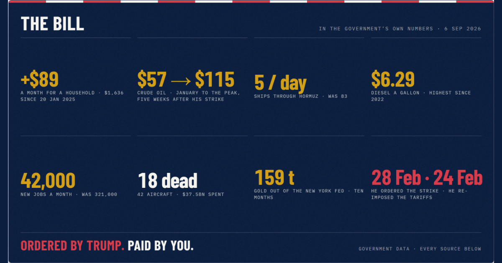

# Trump's Economy — a ledger

**What happened to US prices, jobs and wages since January 2025, measured against
other rich countries.**

A single-page data site built entirely on published government statistics. Every
number traces to a named series. Nothing is modelled, smoothed, or invented — and
the things it declines to claim are written down alongside the things it does.



---

## The argument

Most comparisons between administrations are worthless, and a sharp reader knows it.
Presidents inherit recessions. Pandemics arrive. Comparing raw inflation under one
president to raw inflation under another mostly measures who was unlucky.

This site's method is to **use other rich countries as a control group.**

The 2021–22 inflation surge was global — supply chains, energy, the post-pandemic
reopening hit every advanced economy at once. So the question that isolates domestic
policy is not *"how much inflation happened under this president?"* but *"how much
more than countries facing the same shock?"*

| Administration | US inflation | Euro area | **US-specific excess** |
|---|---|---|---|
| Clinton | 2.39% | 1.54% | +0.85 |
| Bush | 2.80% | 2.35% | +0.45 |
| Obama | 1.40% | 1.18% | **+0.23** |
| Trump I | 1.88% | 1.17% | +0.71 |
| **Biden** | **4.98%** | **4.72%** | **+0.26** |
| **Trump II** | **2.89%** | **2.23%** | **+0.66** |

At the October 2022 global peak, US inflation was **2.88 points below** the euro area.
Today it is **0.80 points above**.

> When the whole world had inflation, America had slightly less than average.
> Now that the world doesn't, America has more.

Biden's 5% was the world's 5%. The current term's 3% is America's alone — with no
pandemic, no financial crisis, and no global shock to point at.

---

## What's on the page

| Section | What it does |
|---|---|
| **The bill** | Crude oil, 394 daily closes, with war events marked |
| **The shelf** | Grocery staples in actual dollars — not index points |
| **The lines crossed in between** | US vs peer-country inflation, and the excess by administration |
| **Twenty percent of the world's oil** | A playable Strait of Hormuz simulation |
| **Two choices, two signatures** | The war shows up in the tails; the tariffs in the core |
| **A frozen labour market** | Job creation, and why the unemployment rate is the wrong number |
| **The other side of the coin** | What is genuinely going well |
| **Check our work** | Sources, and a correction we made to ourselves |

### The simulation

Press play or drag the scrubber through 214 days. Transit volume, war-risk insurance
and the crude price move together; the vessel layer empties when the strait closes and
refills when it reopens.

Transit and war-risk are **stepped values with as-of dates, never interpolated** — the
strait did not close or reopen gradually, and drawing a smooth curve between 0.0 and
4.8 mb/d would assert intermediate values nobody measured.

---

## Rules this project follows

These are enforced in code, not just intended.

**Zero fabrication.** Every number comes from an endpoint or a labelled, adjustable
assumption. Missing data renders as "no data", never as a plausible-looking
placeholder. An earlier version of this project shipped `Math.random()` sparklines and
invented Reuters headlines; that is the failure mode everything here is designed
against.

**Every claim carries its falsifier.** Each analysis returns a `MethodEnvelope` with
its assumptions, caveats, and an explicit statement of what result would disprove it.
The envelope builder *raises* if the falsifier list is empty — a causal claim with no
stated falsifier is not a causal claim.

**Rows that cut against the argument stay visible.** Eggs are down 45%/yr, because
avian influenza resolved rather than because of policy, and the page says so. The S&P
is up. Initial claims are low.

**The war effect and the tariff effect are never summed.** The Dallas Fed found the
SCOTUS tariff rollback and the Hormuz shipping-cost increase roughly cancel. The
headline spike is the war; the tariffs are the slow creep in the core. Different
frames, different numbers.

**Gaps render as gaps.** October 2025 CPI was never collected during the 43-day
shutdown. Charts split their path on nulls so the hole shows, rather than drawing a
straight line through a value nobody measured.

### Claims tested and cut

Written up in [`docs/THESIS.md`](docs/THESIS.md):

- **"The Inflation Reduction Act lowered inflation."** CBO called the effect
  "negligible"; Penn Wharton found it statistically indistinguishable from zero.
- **"US inflation fell faster than any G7 country."** It is 6th of 8 on share of peak
  removed, and never held 12 straight months below 3%.
- **"Inflation statistics are being manipulated."** No evidence. The decisive test runs
  the other way: Truflation, an independent measure built on 15M daily prices, reads
  *below* official CPI. Suppression would make it read higher.
- **Any point estimate for the tariff share.** No defensible import-content weight per
  CPI category is available, so it ships as a bound.

---

## Architecture

```
backend/                     FastAPI + numpy. No pandas, no statsmodels —
  services/                  they would take ~100MB of a 256MB Fly VM.
    timeseries.py            Alignment, resampling, the leakage guard
    econometrics.py          OLS+HAC, sup-Wald breaks, bootstrap intervals
    attribution.py           Orchestration; every payload carries its envelope
    series_catalog.py        ~50 validated FRED series + administrations
  routers/attribution.py     11 endpoints, 7-day cached
  scripts/build_snapshot.py  Freezes real responses for static hosting
  tests/                     24 synthetic-truth tests

frontend/
  src/v4/                    Data layer, SVG charts, Hormuz simulation
  src/pages/LedgerPage.tsx   Page composition
  scripts/build-og.mjs       Renders og.png at build time
```

### The estimators

Every statistical routine is checked two ways: **recovery** (plant a known effect, find
it) and **size** (plant nothing, stay quiet). Size tests matter more — an estimator that
finds a break in white noise would manufacture exactly the conclusion this project wants
to reach, which is the one bug that would never look wrong on the finished page.

One of them caught a real error: prediction intervals were covering 83% instead of 95%,
because tail percentiles estimated from a few hundred bootstrap draws bias inward. A
too-narrow no-war band manufactures a war effect, so the replication count is now floored
in code rather than defaulted.

### A correction we made to ourselves

An earlier version reported June 2026 inflation as **3.73%**. It was **3.53%**.

The year-over-year calculation indexed twelve *observations* back rather than twelve
*months*. October 2025 CPI does not exist — it was never collected — so every figure
after that gap reached back thirteen months. The wrong number had already propagated
into a design brief before it was caught.

It is fixed, covered by a regression test, and described on the page itself. A site that
asks you to check its work should show what happens when someone does.

---

## Running it

```bash
# backend
cd backend
py -m uvicorn main:app --reload --port 8000

# frontend
cd frontend
npm install
npm run dev
```

The frontend defaults to a committed data snapshot, so it runs with no backend at all.
Flip `SOURCE` in `src/v4/data.ts` to `'api'` for live data.

If port 8000 is taken: `BACKEND_PORT=8020 npm run dev`.

**Rebuild the snapshot** after new data lands:

```bash
cd backend && py scripts/build_snapshot.py
```

**Run the tests:**

```bash
py -m pytest backend/tests/ -q
```

### Other views

| URL | View |
|---|---|
| `/` | V4 ledger (current) |
| `/?view=receipt` | V3 — household cost calculator |
| `/?view=broadsheet` | V2 — war-room broadsheet |
| `/?view=dashboard` | V1 — classic dashboard |

---

## Data sources

Bureau of Labor Statistics · Bureau of Economic Analysis · Federal Reserve · Energy
Information Administration · Eurostat · Cleveland Fed · Dallas Fed — all retrieved
through [FRED](https://fred.stlouisfed.org/).

Requires a free [FRED API key](https://fred.stlouisfed.org/docs/api/api_key.html) in
`backend/.env` to rebuild the snapshot. The committed snapshot needs nothing.

### Known limits

- **October 2025 CPI does not exist.** Never collected; every 12-month change spanning
  it is undefined.
- **Gasoline and diesel are not seasonally adjusted.** Part of every Jan→May rise is
  summer-blend changeover.
- **US CPI and euro-area HICP are built differently.** Owners' equivalent rent is ~24%
  of the US basket and 0% of the euro-area basket — worth roughly a point of the 2022
  gap.
- **Vessel positions in the simulation are illustrative, not AIS data.** No verified
  queue count exists at any tier, so none is published.

---

## Licence

Code MIT. The underlying data is US and EU government statistics, in the public domain
or freely redistributable under the originating agency's terms.
