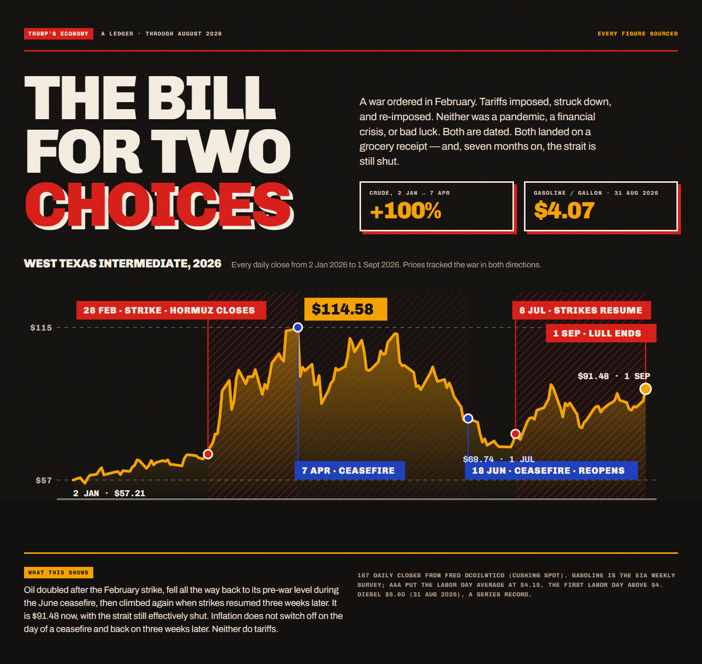
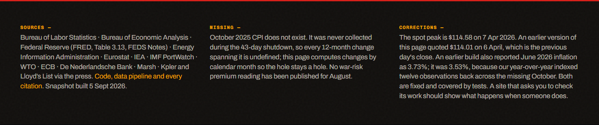
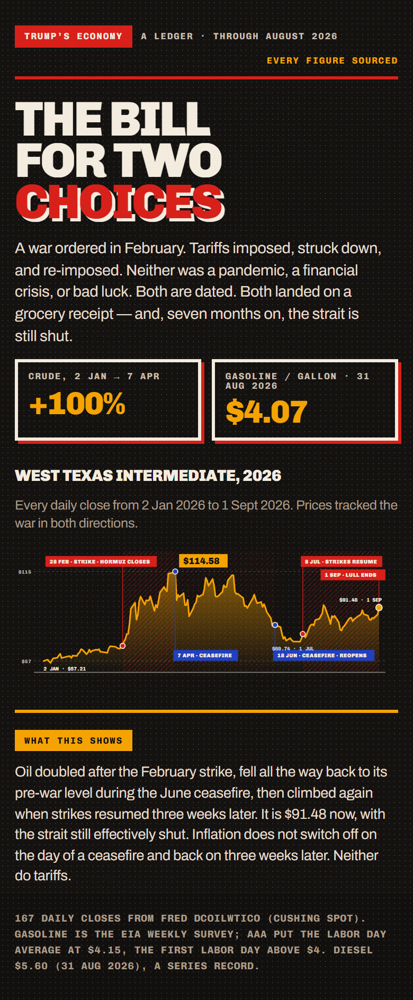
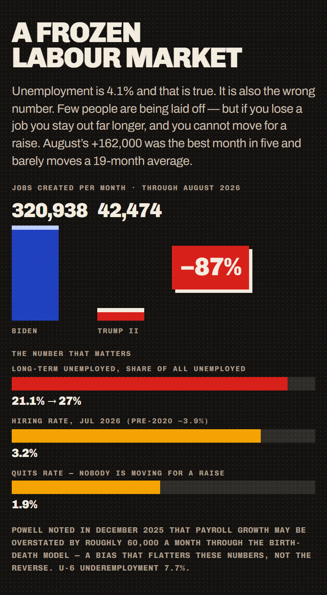
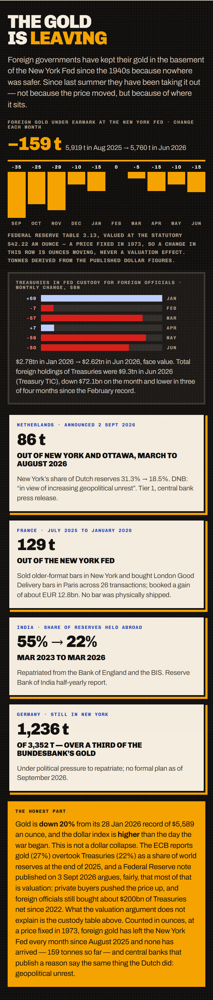
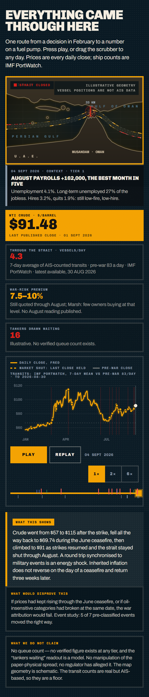

# Trump's Economy — a ledger

**What happened to US prices, jobs, wages, trade and the gold in the New York Fed's
basement since January 2025, measured against other rich countries.**

A single-page data site built on published statistics. Every number traces to a named
series or a cited, tiered source. Nothing is modelled, smoothed, or invented — and the
things it declines to claim are written down alongside the things it does.

**Updated 5 September 2026** — seven months into the Iran war, with the Strait of Hormuz
effectively shut since early July.



---

## The argument

Most comparisons between administrations are worthless, and a sharp reader knows it.
Presidents inherit recessions. Pandemics arrive. Comparing raw inflation under one
president to raw inflation under another mostly measures who was unlucky.

This site's method is to **use other rich countries as a control group.**

The 2021–22 inflation surge was global — supply chains, energy, the post-pandemic
reopening hit every advanced economy at once. So the question that isolates domestic
policy is not *"how much inflation happened under this president?"* but *"how much
more than countries facing the same shock?"*

| Administration | US inflation | Euro area | **US-specific excess** |
|---|---|---|---|
| Clinton | 2.39% | 1.54% | +0.85 |
| Bush | 2.80% | 2.35% | +0.45 |
| Obama | 1.40% | 1.18% | **+0.23** |
| Trump I | 1.88% | 1.17% | +0.71 |
| **Biden** | **4.98%** | **4.72%** | **+0.25** |
| **Trump II** | **2.88%** | **2.23%** | **+0.65** |

At the October 2022 global peak, US inflation was **2.88 points below** the euro area.
In July 2026 it is **0.43 points above** — a narrower gap than in the spring, because the
same oil shock is now lifting Europe too. The page says so rather than leaving the spring
number on the chart.

> When the whole world had inflation, America had slightly less than average.
> Now that the world doesn't, America has more.

---

## What's on the page

Eleven sections, each captured below from the built site. Every chart carries a
plain-English **"what this shows"** callout stating the finding rather than the axes —
the page is designed to work if you read only those.

Since September 2026 **every figure on the page is computed from the data snapshot**.
The August build carried its numbers as literals in the page code; a month later all of
them were stale and nothing said so. Refreshing the whole site is now one command.

### 01 · The bill for two choices

Every daily WTI close of 2026, with the war events flagged. Prices fell for twelve months
*before* the war, doubled in five weeks after a dated strike, round-tripped to pre-war
levels during the June ceasefire, and climbed again when strikes resumed. $91 at the
latest close, with the strait still shut.


### 02 · The shelf

Groceries in actual dollars, not index points. Diesel joins the shelf this month at a
series record, because diesel is the price of moving everything else on it.


### 03 · The lines crossed in between

The control-group argument, drawn — now with all 45 months rather than two endpoints.
The lines cross in October 2023 and the US has run above the euro area since.


### 04 · Two choices, two signatures

The war and the tariffs are kept **separate and never summed** — the Dallas Fed found
the SCOTUS tariff rollback and the Hormuz shipping-cost increase roughly cancel. The war
shows up in the tails (gasoline +25%, energy +14%); the tariffs in the core (core PCE
2.61% → 3.34%).


### 05 · A frozen labour market

Leads with **long-term unemployment (21.1% → 27.0%)** rather than the unemployment
rate. August's +162,000 payrolls — the best month in five — is stated in the first
paragraph and in "the other side"; it lifts a 19-month average to 42,000 against 321,000.


### 06 · The squeeze *(new)*

What households expect and what money costs. Sentiment 51.7, year-ahead inflation
expectations 4.0%, a 10-year yield of 4.77% and a Fed that is now more likely than not to
*raise* rates in September. The mortgage rate is lower than at the handover, and is
shown as the row that cuts the other way.


### 07 · The gold is leaving *(new)*

The Fed's own custody table. Gold held at the New York Fed for foreign governments is
booked at a statutory $42.22 an ounce fixed in 1973, so a change in the row is **ounces,
not price**. It has fallen or held flat every month since August 2025 — about 159 tonnes
out. The Dutch moved 86 t out this year "in view of increasing geopolitical unrest"; the
French 129 t; India cut its share held abroad from 55% to 22%.

The honest part sits at full size: gold is *down* 20% from its January record, the
dollar index is *up* since the war began, and a Fed note from 3 September argues the
"gold overtook Treasuries" headline is mostly valuation. The page quotes it, and notes
that the valuation argument does not explain the ounce-denominated custody decline.


### 08 · Less is moving *(new)*

The WTO's trade forecast (4.6% → 1.9%, or 1.4% if energy stays high); measured Hormuz
transits from IMF PortWatch against a pre-war 83 a day — with the President's "some 30
ships every night" drawn as a hatched bar next to them; and the IEA, BEA, Drewry and
IATA figures that follow from a fifth of the world's seaborne oil not moving.


### 09 · Everything came through here

The playable Strait of Hormuz simulation, now running on **measured series**: every
daily close from FRED and every day of IMF PortWatch transit counts. The scrubber extends
to the latest dated event automatically. The vessel layer remains illustrative and says so.


### 10 · The other side of the coin

Rows that cut *against* the thesis, rendered at full size: eggs down 56% a year, core CPI
2.5%, median CPI 2.7%, August payrolls +162,000, the S&P 500 up 29%, the dollar up since
the war began.


### 11 · Check our work

Every source, what is missing, and two corrections the project made to itself.



### On a phone

The layout is driven by container queries and `auto-fit` grids rather than breakpoints,
so it reflows continuously instead of snapping at fixed widths. Measured at 390px:
**0px of horizontal overflow.**

| Masthead | Labour market | Gold | The strait |
|---|---|---|---|
|  |  |  |  |

> Screenshots are generated from the built site by `frontend/scripts/shoot.mjs`, which
> renders under `prefers-reduced-motion: reduce`. The page treats that as *static but
> complete* — every counter at its final value, every bar grown, the simulation stepped
> to a settled end state. Regenerate with `node scripts/shoot.mjs <url> ../docs/screenshots`.

---

## Rules this project follows

These are enforced in code, not just intended.

**Zero fabrication.** Every number comes from an endpoint, a labelled adjustable
assumption, or a curated figure with a source, URL and tier in
`backend/data/context_figures.json`. Missing data renders as "no data", never as a
plausible-looking placeholder.

**Nothing is retyped.** The page renders a `Figures` object derived from the snapshot
(`frontend/src/v4/ledger-data.ts`). If a number is on the page, it came from a series or
a cited entry, and it carries its as-of date.

**Every claim carries its falsifier.** Each analysis returns a `MethodEnvelope` with
its assumptions, caveats, and an explicit statement of what result would disprove it.
The envelope builder *raises* if the falsifier list is empty.

**Rows that cut against the argument stay visible.** Eggs are down because avian
influenza resolved. The S&P is up. August payrolls beat. Mortgage rates are lower. Gold
is down and the dollar is up. All at full size.

**The war effect and the tariff effect are never summed.**

**Gaps render as gaps.** October 2025 CPI was never collected during the 43-day
shutdown. Every 12-month change is computed by calendar month, so the hole stays a hole.

**Official claims are shown next to measured data, labelled as claims.** "Some 30 ships
every night" is drawn as a hatched bar beside the AIS counts, not omitted and not adopted.

### Claims tested and cut

Written up in [`docs/THESIS.md`](docs/THESIS.md):

- **"The Inflation Reduction Act lowered inflation."** CBO: "negligible".
- **"US inflation fell faster than any G7 country."** 6th of 8.
- **"Inflation statistics are being manipulated."** No evidence; Truflation reads *below* CPI.
- **"Countries are pulling all their gold out of America."** Not all, and Germany has
  moved none. The defensible claim is the Fed's own table: ~159 t out over ten months,
  every month negative or flat, plus three named central banks with stated reasons.
- **Any point estimate for the tariff share.** Ships as a bound.

---

## Architecture

```
backend/                     FastAPI + numpy. No pandas, no statsmodels.
  services/
    timeseries.py            Alignment, resampling, the leakage guard
    econometrics.py          OLS+HAC, sup-Wald breaks, bootstrap intervals
    attribution.py           Orchestration; every payload carries its envelope
    macro.py                 Point-in-time readouts; 12-month changes by calendar month
    portwatch.py             IMF PortWatch daily Hormuz transits (free, no key)
    series_catalog.py        ~50 validated FRED series + administrations
  data/
    war_milestones.json      Dated events; `study: true` ones feed the event study
    context_figures.json     Curated, tiered figures that do not live on FRED
  routers/attribution.py     14 endpoints, cached
  scripts/build_snapshot.py  Freezes real responses for static hosting
  tests/                     28 synthetic-truth tests

frontend/
  src/v4/ledger-data.ts      Snapshot -> Figures. The only place numbers are derived.
  src/v4/hormuz/engine.js    Simulation; runs on daily closes + PortWatch counts
  src/pages/LedgerPage.tsx   Page composition — renders Figures, types nothing in
  scripts/build-og.mjs       Renders og.png from the snapshot at build time
  scripts/shoot.mjs          Per-section screenshots for this README
```

### Corrections we made to ourselves

- **June 2026 inflation was reported as 3.73%. It was 3.53%.** The year-over-year
  indexed twelve *observations* back across the missing October 2025. Fixed, tested, and
  described on the page.
- **The crude peak was reported as $114.01 on 6 April. It is $114.58 on 7 April**, the
  day the first ceasefire was announced. The anchors now come from the series, not a
  table, so this class of error cannot recur.

---

## Running it

```bash
# backend
cd backend
py -m uvicorn main:app --reload --port 8000

# frontend
cd frontend
npm install
npm run dev
```

The frontend defaults to a committed data snapshot, so it runs with no backend at all.
Flip `SOURCE` in `src/v4/data.ts` to `'api'` for live data.

**Refresh the whole site** after new data lands (this is the entire update process):

```bash
cd backend && py scripts/build_snapshot.py
cd ../frontend && npm run build
```

**Run the tests:**

```bash
py -m pytest backend/tests/ -q
```

### Other views

| URL | View |
|---|---|
| `/` | V4 ledger (current) |
| `/?view=receipt` | V3 — household cost calculator |
| `/?view=broadsheet` | V2 — war-room broadsheet |
| `/?view=dashboard` | V1 — classic dashboard |

---

## Data sources

Bureau of Labor Statistics · Bureau of Economic Analysis · Federal Reserve (FRED, Table
3.13, FEDS Notes) · Energy Information Administration · Eurostat · IEA · IMF PortWatch ·
WTO · ECB · De Nederlandsche Bank · Cleveland Fed · Dallas Fed — plus Marsh, Kpler and
Lloyd's List figures as reported by S&P Global, USNI News, CNBC and Al Jazeera, each
marked Tier 2 in `context_figures.json`.

Requires a free [FRED API key](https://fred.stlouisfed.org/docs/api/api_key.html) in
`backend/.env` to rebuild the snapshot. PortWatch needs no key. The committed snapshot
needs nothing.

### Known limits

- **October 2025 CPI does not exist.** Never collected.
- **PortWatch is a floor, not a census.** AIS-dark vessels are not counted.
- **FRED daily closes lag two to three trading days.** The simulation says "last
  published close" beyond the last print rather than interpolating.
- **No live gold price series exists on FRED.** Price figures are Tier 2 and appear only
  in the honest-part panel.
- **Gasoline and diesel are not seasonally adjusted.**
- **US CPI and euro-area HICP are built differently.** Owners' equivalent rent is ~24%
  of the US basket and 0% of the euro-area basket.
- **Vessel positions in the simulation are illustrative.** Counts are real; positions are not.

---

## Licence

Code MIT. The underlying data is US and EU government statistics, in the public domain
or freely redistributable under the originating agency's terms.
