# The Bill

**What the 2026 Iran war and the tariffs cost an American household, told in eleven
animated blocks and measured only in the government's own numbers.**

**Live: [trumps-economy-the-bill.pages.dev](https://trumps-economy-the-bill.pages.dev)** ·
[about the project](https://samizdat-publications.github.io/oil-tracking-dashboard/) ·
[the thesis and every source](docs/THESIS.md)

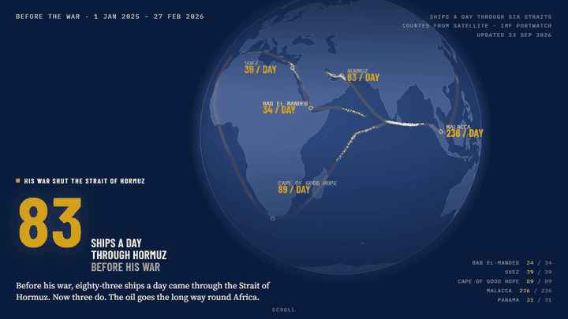

*The opening block. Every particle is a share of a real daily count from IMF PortWatch
satellite data; scroll and the war begins, and the Strait of Hormuz empties while the
other five straits hold.*

**Updated 23 September 2026.** Crude to 22 Sep, ship counts to 20 Sep, pump prices to
21 Sep, shop prices, jobs and CPI to August. The page itself always says how far each
figure runs.

---

## The page

The page is a scroll-driven data story on a single route. Each block plays once when
it comes into view, then holds still; with reduced motion on, every block is drawn at
its end state and nothing moves. Every block has a **Show the work** panel with the
series IDs, the dates and the method.

| | |
|---|---|
| 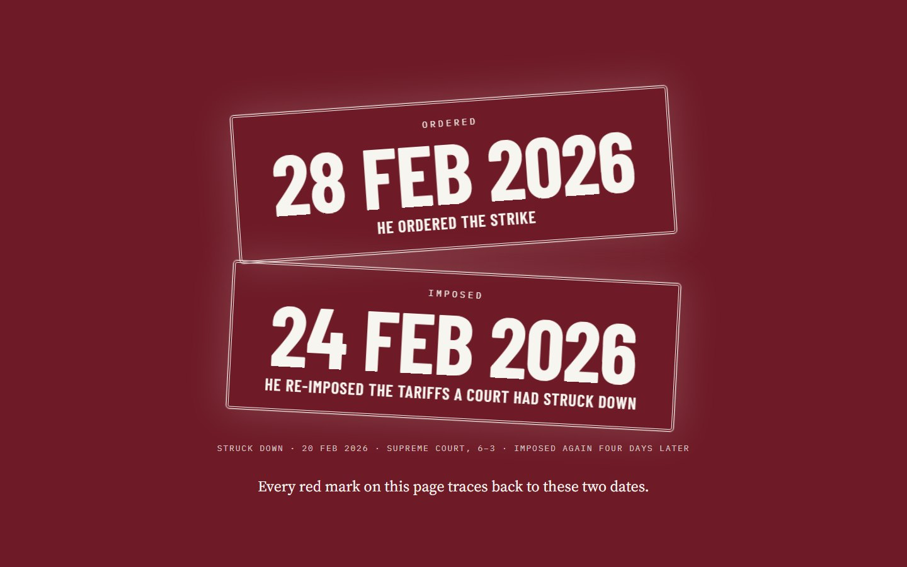 | 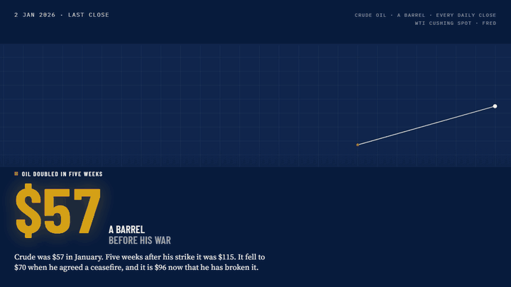 |
| **01 · Two dates.** 24 February, the tariffs re-imposed. 28 February, the strike. Every red mark on the page traces back to one of them. | **02 · Oil doubled.** Every daily WTI close of 2026 on a moving seismograph: $57 in January, $114.58 on 7 April, and back up when the strikes resumed. |
|  | 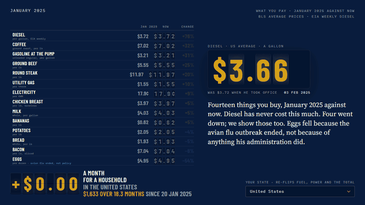 |
| **03 · The strait.** The real Traffic Separation Scheme on a Natural Earth coastline. One ship on screen for each ship a day: 83 before the war, 3 now, beside the President's "30 a night". | **04 · Your prices.** A split-flap board of fourteen prices, January 2025 against the latest month. Pick your state and the fuel and electricity rows re-total. |
| 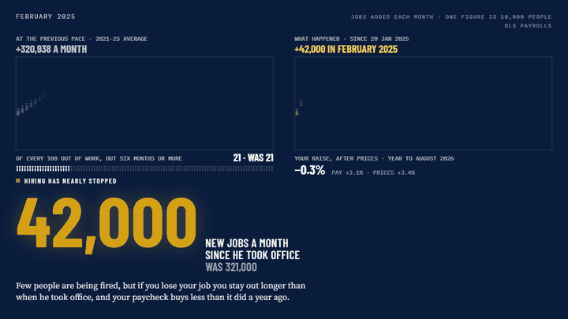 | 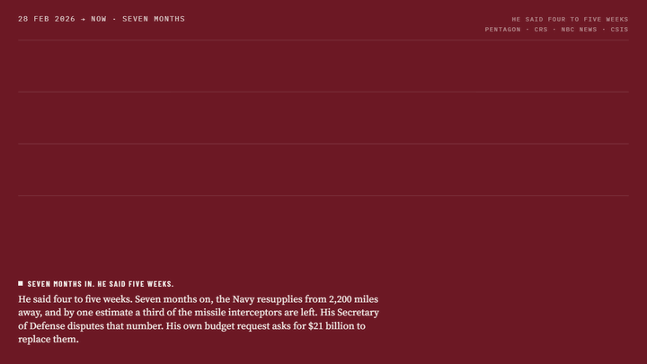 |
| **05 · Nobody is hiring.** One figure per 10,000 jobs: 320,938 a month in 2021-25 against 42,474 since. It also explains why jobless claims are low while hiring is frozen. | **06 · What the war cost.** US service members killed, 42 aircraft lost or damaged, $43.6 billion spent, and the interceptor count the Defense Secretary disputes, printed beside the dispute. |
| 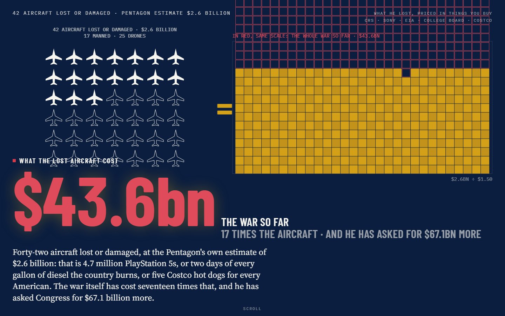 | 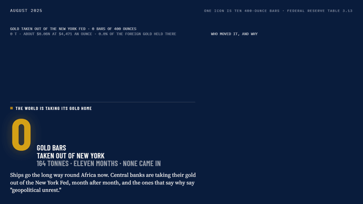 |
| **07 · What it buys.** The lost aircraft priced in PlayStations, gallons of diesel, years of tuition and hot dogs, then the whole war at the same scale. | **08 · The world backs away.** One ingot per tonne of foreign gold at the New York Fed, leaving month by month, with the Fed's own rebuttal at full size. |
| 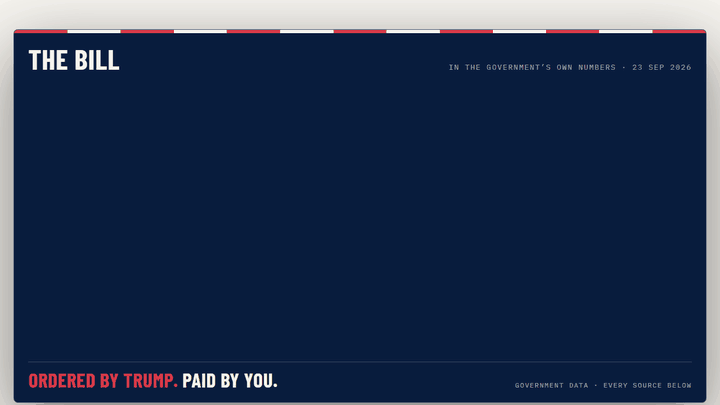 | 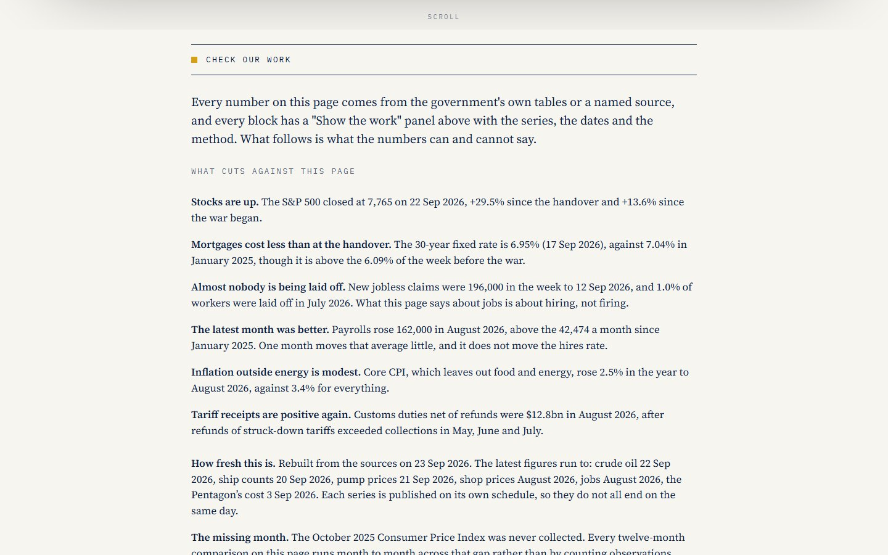 |
| **09 · Your bill.** The share card, rendered from the real block, so the card and the page can never disagree. | **10 · Check our work.** What cuts against this page, how fresh each figure is, and what the numbers can and cannot say. |

<p align="center">
  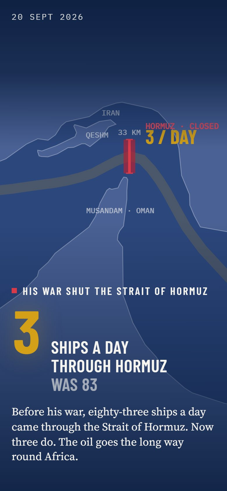
  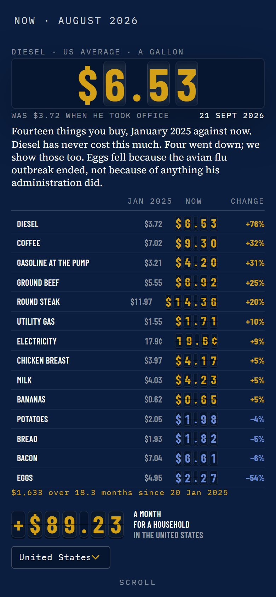
  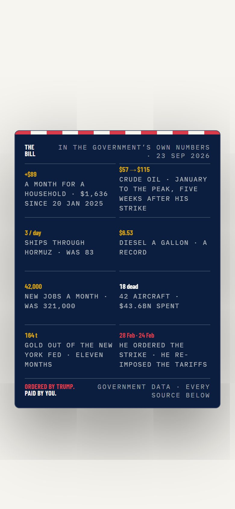
</p>

---

## The argument, and its method

Most comparisons between administrations mostly measure who was unlucky: presidents
inherit recessions, and pandemics arrive. This project isolates policy two ways.

**Two dates.** The page traces costs to two decisions with dates on them: the tariffs
re-imposed on 24 February 2026 and the strike on Iran on 28 February. War effects and
tariff effects are never added together.

**Other rich countries as the control group.** The 2021-22 surge was global, so the
question that isolates domestic policy is not "how much inflation?" but "how much more
than countries facing the same shock?"

| Administration | US inflation over the euro area, points a year |
|---|---|
| Clinton | +0.85 |
| Bush | +0.45 |
| Obama | +0.23 |
| Trump I | +0.71 |
| Biden | +0.26 |
| **Trump II (in progress)** | **+0.62** |

That gap is narrowing, and the project says so. In August 2026 US inflation was 3.40%
against 3.23% in the euro area, a gap of 0.17 points, down from 0.43 in July, because
the same oil shock is now lifting Europe too. That strengthens the reading of a global
energy shock and weakens any claim of an America-only excess.

---

## Rules this project follows

**Zero fabrication.** Every number comes from a government series or from a curated
entry in [`backend/data/context_figures.json`](backend/data/context_figures.json) with
a source, a URL, a tier and a date. Missing data says so.

**No moving figure is typed.** Any sentence that states a verdict about a number the
next release can change is built from the data at render time: whether diesel is a
record, "the best month in five", the Pentagon's latest cost, each "as of" date. This
rule exists because the page once said "not a record" for two refreshes after EIA's
weekly diesel passed its 2022 peak.

**What cuts against the page is shown at full size.** Stocks are up, mortgages are
cheaper than at the handover, almost nobody is being laid off, core inflation is modest,
customs receipts turned positive again in August. A row drops out only when it stops
being true.

**Official claims are drawn next to the measurement and labelled as claims.** "Thirty
ships a night" sits beside the satellite count. Disputed estimates carry the denial.

**Gaps render as gaps.** October 2025 CPI was never collected; every twelve-month change
is matched by calendar month, so the hole stays a hole.

### Claims tested and cut

Written up in [`docs/THESIS.md`](docs/THESIS.md): the Inflation Reduction Act lowering
inflation (CBO: "negligible"), US inflation falling faster than any G7 country (6th of
8), statistics being manipulated (no evidence), "everyone is pulling their gold out"
(not all, and Germany has moved none), and any point estimate for the tariff share.

---

## How it is built

```
backend/  Python. Pulls the public data and freezes it into one snapshot.
  services/            FRED, EIA, Treasury Fiscal Data, IMF PortWatch, the attribution maths
  data/                context_figures.json and war_milestones.json, curated and tiered
  scripts/
    build_snapshot.py  every source -> frontend/public/data-snapshot.json
    validate_snapshot.py  the gate: missing, errored or stale blocks stop the deploy
    build_v5_data.py   the snapshot -> the four files V5 reads; fails if a block cannot refresh
    record_refresh.py  appends the headline figures to docs/refresh-history.csv
    refresh.ps1        the whole refresh, test, build and deploy, in one command

frontend/  React 19 + Vite. Static: no server at runtime.
  src/v5/TheBill.jsx   the page: a port of the Claude Design prototype, not a rewrite
  scripts/template-to-jsx.py  converts the prototype's template to JSX mechanically
  scripts/build-og.mjs renders the share card from the real block 09
  scripts/shoot-v5.mjs these screenshots and clips
```

The page is a port of a design prototype
([`docs/design-handoff/2026-09-08-the-bill`](docs/design-handoff/2026-09-08-the-bill)).
Markup changes go into the prototype and are converted mechanically, so copy and styling
never drift by hand.

## Refreshing the data

Refresh is on demand, after something that moves the numbers: a strike, a ceasefire, a
jobs report, a tariff ruling. On Windows:

```powershell
.\backend\scripts\refresh.ps1          # rebuild, gate, test, build, deploy V5 and V4, commit
.\backend\scripts\refresh.ps1 -Dry     # everything except deploy and commit
```

The same sequence runs from GitHub Actions (`refresh-and-deploy`, run manually). It needs
four repository secrets: `FRED_API_KEY`, `EIA_API_KEY`, `CLOUDFLARE_API_TOKEN` and
`CLOUDFLARE_ACCOUNT_ID`. Every refresh appends a row to
[`docs/refresh-history.csv`](docs/refresh-history.csv), the only place the history of
the headline figures is kept.

## Data sources

Bureau of Labor Statistics · Bureau of Economic Analysis · Federal Reserve (FRED, Table
3.13, FEDS Notes, FOMC) · Energy Information Administration · Treasury (Debt to the
Penny, Monthly Treasury Statement) · IMF PortWatch · Eurostat · IEA · Congressional
Research Service · CBO, plus reported figures (Roll Call, Lloyd's List Intelligence,
Axios, CNBC and others) marked Tier 2 in `context_figures.json`.

### Known limits

- **PortWatch counts are a floor, not a census.** Ships with their transponders off are
  not counted; Lloyd's List, which verifies dark transits, counts more.
- **Brent spot and Brent futures are different instruments.** In September futures fell
  below $100 while EIA's spot price stayed above $114. The page draws WTI spot only.
- **FRED daily closes lag by about a week**, because EIA posts spot prices weekly.
- **Ship positions are a model; the counts are not.**
- **US CPI and euro-area HICP are built differently.** Owners' equivalent rent is about
  a quarter of the US basket and none of the euro-area one.

## Other views

The previous design, the V4 "ledger", is kept at
[trumps-economy-ledger-v4.pages.dev](https://trumps-economy-ledger-v4.pages.dev) and at
`?view=ledger` on the live site.

## Licence

Code MIT. The underlying data is US and EU government statistics, public domain or freely
redistributable under each agency's terms.
